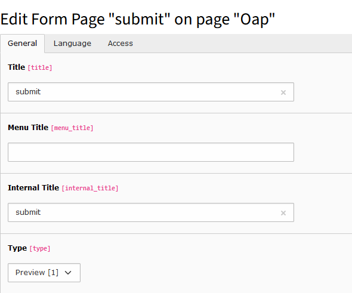
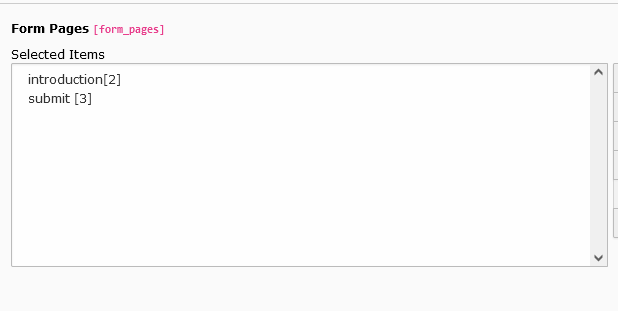
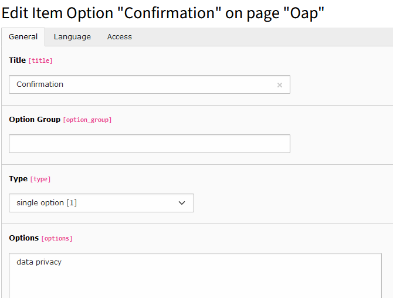
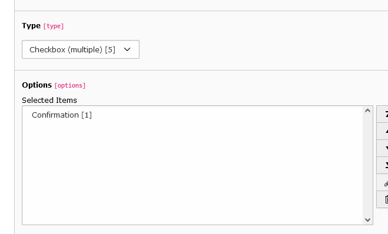
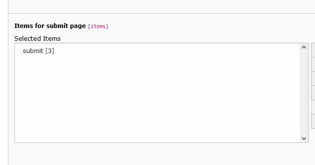

# How to Create Call Records

Call records must be created before they can be displayed in the frontend. Set configuration PIDs to correct folder PIDs
before creating records.

See more:

- [Setup constants](../Configuration/constants.md)
- [Setup TsConfig](../Configuration/tsconfig.md)

## Creating Call Group Records

1. Navigate to the `Web > List` module.
2. Navigate to the Call Group folder.
3. Use the "Create New Record" icon in the top bar and select the Call Group entry.
4. Fill in all the required fields and click on Save.

## Creating Supporter Records

1. Navigate to the Supporter folder.
2. Create a new record and select the Supporter entry.
3. Fill in all the required fields and click on Save.

## Creating a Form Item

1. Navigate to the Form Item folder.
2. Create a new record and select the Form Item entry.
3. Optionally, create modifiers and validators before using them.
4. Fill in all the required fields and click on Save.

## Creating Group Title Records

1. Navigate to the Groups folder.
2. Create a new record and select the Group Title entry.
3. Fill in all the required fields and click on Save.

## Creating a Form Group

1. Navigate to the Groups folder.
2. Tip: To select Form and Group items it is necessary to create the records before and set the right PID's in the
   settings.
3. Create a new record and select the Form Group item.
4. Fill in all the required fields and click on Save.

## Creating a Form Page

1. Navigate to the Form Pages folder.
2. Tip: To select item groups, it is necessary to create the record Form Group before and set the correct PID in the
   settings.
3. Create a new record and select the Form Page item.
4. Fill in all the required fields and click on Save.

## Creating a Call

1. Navigate to the Calls folder.
2. Tip: To select Form Pages it is necessary to create the record Form Group before and set the right PID in the
   settings.
3. Create a new record and select the Call entry.
4. Fill in all required fields and click Save.
5. Submit page:
    - Create a Form Page and select the Preview type.

      

    - Add the new Form Page you have created to the call.

      

    - You must create a form item of type Checkbox(multiple), create an item option for it, and add it to the items for
      Submit page.

      Without this, you won't be able to submit the form in the frontend.

    - Create an Item Option

      

    - Add the Item Option to the Form Item

      

    - Add finally to the Call

      
