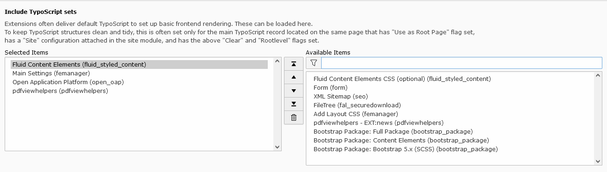

# Including static TypoScript

It is necessary to include at least the basic TypoScript provided by this extension.

Go to module `Web > Template` and select your root page. It should already contain a TypoScript template entry. Switch
to the view `Info/Modify` and click on `Edit the whole template record`.

Switch to the `Includes` tab and add the following templates from the list on the right in this order:

* Main Settings
* Open Application Platform
* pdfviewhelpers

Read more about possible configurations using TypoScript in the [constants](../Configuration/constants.md) section.

## Further reading

*  [Constants](../Configuration/constants.md), mainly configuration for the frontend
*  [TsConfig](../Configuration/tsconfig.md), configuration for the backend
*  [Language](../Configuration/overwriting-xlf-items.md), configuration for language override

ddev typo3 extension:setup
