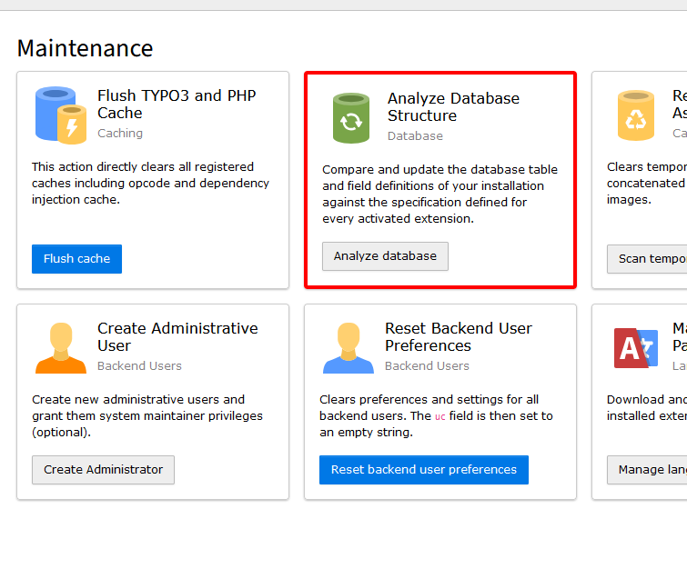
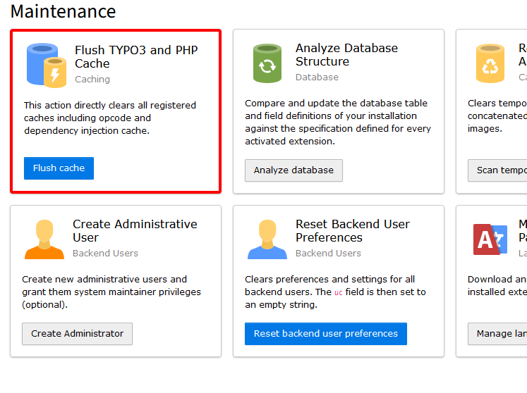

# Installing this extension

In a composer-based TYPO3 installation, you can install the `open_oap` extension via composer.

```
composer require openoap/open-oap
```

This is the recommended method. The extension will be activated automatically.

## Update the database schema

Open your TYPO3 backend with system maintainer rights.

In the module menu on the left, navigate to `Admin Tools > Maintenance`, then click on `Analyse database` and apply all
the suggested changes.



## Flush all caches

In the same module `Admin Tools > Maintanance` you can also empty all caches by clicking on the button `Flush cache`.


