# Open OAP - Editing Manual for creating a call

**Status:** Version 1.1
**Date:** 30.10.2023

## Structure overview

A call can consist of several pages. Several groups can be arranged on one page. There can be any number of elements/items in a group.

### Call

This is the top item and thus corresponds to the form itself, but also contains data on the course of the call (start time. end time - if required, logo data, e-mail etc.. )

In this data set, pages are added for the form.
> [see chapter "Creating a call"](#creating-a-call)

### Call Group

Call group is the top group and separates the calls in the Frontend

> [see chapter "Creating a call group"](#creating-a-call-group)

### Supporter

with supporters calls can grouped in different typs in the call group

> [see chapter "Creating a Supporter"](#creating-a-supporter)

### Page

A form consists of at least one page that contains groups.
> [see chapter "Pages"](#pages)

### Group

Groups contain items (=questions/topics)
In the group records, the items are added and sorted.
> [see chapter "Groups"](#groups)

### Items

The items are the actual questions that can be created in different formats for the answers.
> [see chapter "Items/Elements"](#itemselements)

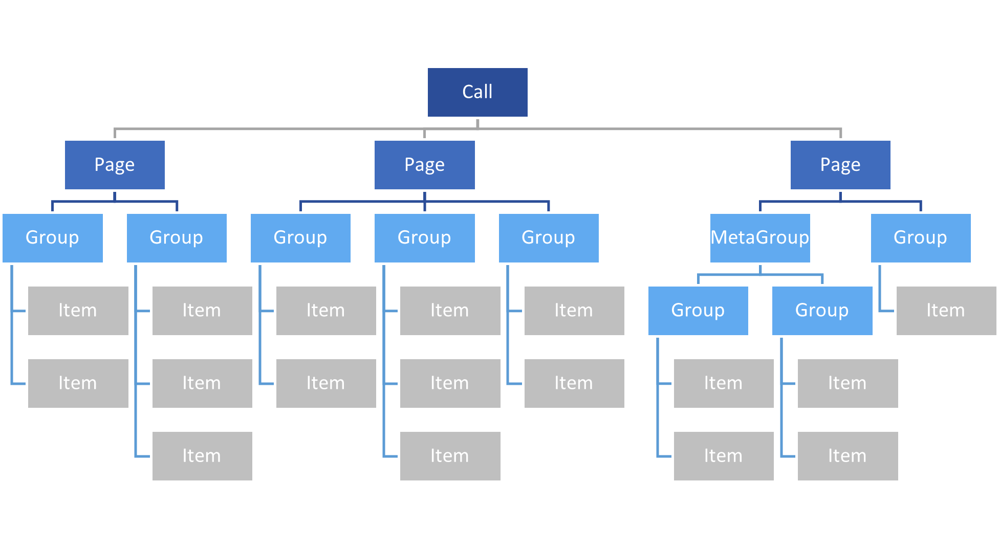

## Editing Backend

With TYPO3, we distinguish between the frontend, i.e. the actual website, and the backend, which provides the editorial functions for maintaining all components of a call.

The TYPO3 backend is accessible via the OAP-URL/typo3

For the project, the basic editorial roles of "editor" and "website editor" were implemented.

### TYPO3 Basics

### The header

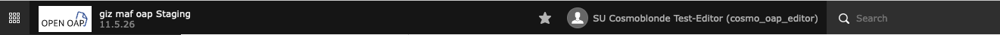

| Field | Description |
|-------|-------------|
|  | Bookmarks: for saving frequently used TYPO3 views. |
|  | Name and login name of the logged-in TYPO3 user; Clicking takes you to the user settings option (e.g. for new password assignment, backend language settings). |
|  | Search in all TYPO3 data sets with auto-suggest function. |

### The module bar

| 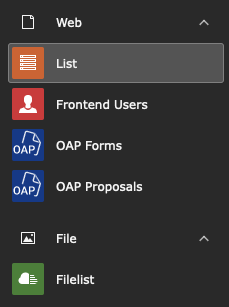 | 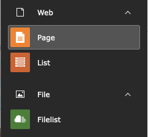 |
|----|----|
| View for editor / clerk | View for website editor |

| Field | Description |
|-------|-------------|
| List | The "List" module lists all data records that exist in this page. The listing is in tabular form, with each table corresponding to a database table. Data records that are not visible in the "Page" module are also listed here. This view is mainly used for editing data records or dynamic data such as news |
| Page | Displays all content elements existing on the page in the TYPO3 backend. The arrangement corresponds to the page layout in the frontend. This view is recommended for editing standard pages. |
| Frontend Users | Here, all logged-in users can be viewed and edited if necessary |
| OAP Forms | Here you can find the previews of created calls |
| OAP Proposals | The submitted proposals can then be found here (separate manual) |
| Filelist | You can access all assets in the system, such as PDF documents or images, via the "File list" module. It is the file repository of the TYPO3 system. |

## Creating an application form

When creating a new call, it is advisable to first create the individual elements (items) and then group them together and assign them to pages.

If all elements are already available or if a call is to be adapted, you can jump directly to the chapter "[Creating a Call](#creating-a-call)".

**Note:** Do not reuse a call, but copy the call record and adapt it to afterwards. All application records reference the call record and continue to do so as long as they are stored in the system. So if you change a call (because you want to continue using it), the call data on the applications would change with it. When copying a call, the pages it contains remain the original pages and are neither copied nor duplicated.
> [see chapter "Create a new call based on an existing call"](#create-a-new-call-based-on-an-existing-call)

### Items/Elements

The items are the actual questions that can be created in different formats for the answers.

All items consist of a heading/question and input options. Optionally, intro text and help text can be added.

Fixed check criteria/validators can be assigned and lead to error messages when saving the form page. It is possible to specify certain items whose values are displayed in the dashboard.

### Creating an item

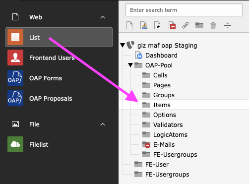

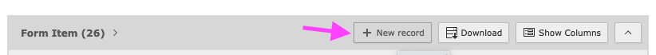

### Form view for creating an item

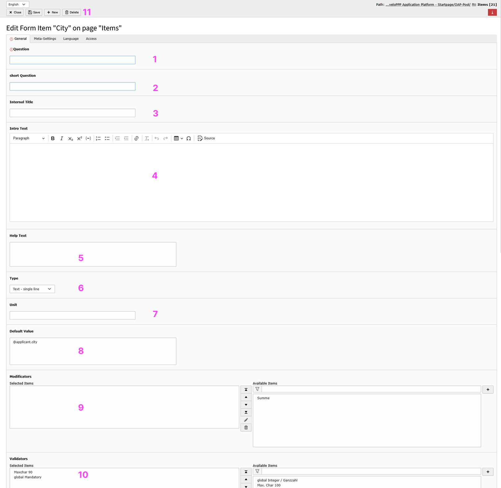 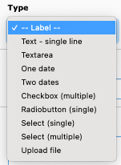

1. **"Question"** - Question/title of the input field (mandatory)

2. **"short Question"** - Optionally, only for CSV export. Replaces the question in the CSV with the short form.

3. **"Internal Title"** - Optionally, a designation can be entered that is only to facilitate sorting and finding in the backend. If no internal title is entered, the question entry is displayed in the search selection.

4. **"Introtext"** - An introductory text can be entered here, with information on the following field. (optional)

5. **"Help Text"** - A help text can be optionally created, which can then be unfolded in the form if required.

6. **"Type"** - The field type is selected here. The selection can influence the following fields. (mandatory)

7. **"Unit"** - If a unit is entered, it is displayed in a field. For example, "EUR" in a simple input field. (optional)

8. **"Default Value"** - Text entered here is pre-entered in the field and can be overwritten. (optional)
   In addition, master data can be pre-entered ([see separate list with variables](#default-from-master-data)).

9. **"Modificators"** - can be added to items like validators

10. **"Validators"** - Predefined or globally available validators can be selected here and assigned to the field. For example, a character limit, number type or whether the field should be a mandatory field. (optional)

11. **"Save"** - Saving the created item

### Text field

Text field with heading/question (Front-end view)

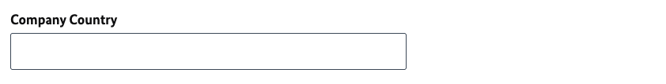

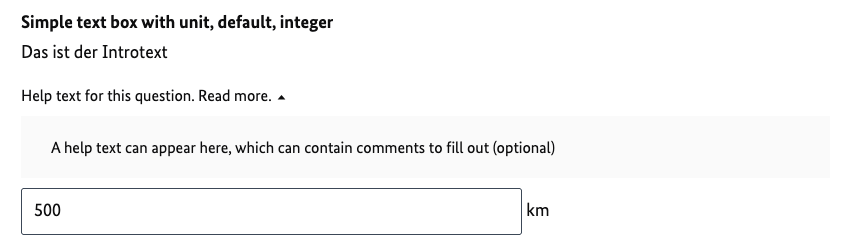

**Options:**

- Intro text
- Help text
- Unit
- Default value
- Validation (e.g. mandatory field, number, character length, etc.)

### Text area

Text area with heading/question for longer texts (Front-end view)

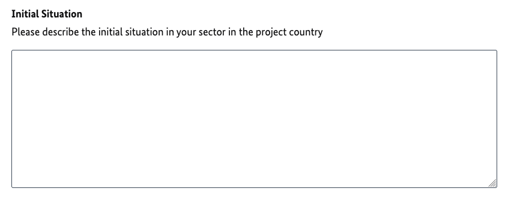

**Options:**

- Intro text
- Help text
- Default value
- Validation (e.g. mandatory field, character length, etc.)

### Date selection

Input field/calendar function (Front-end view)

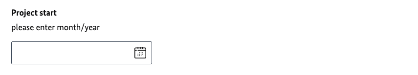

**Options:**

- Intro text
- Help text
- Validation (e.g. mandatory field, earliest possible

### Period

Combined input fields with calendar function (Front-end view)

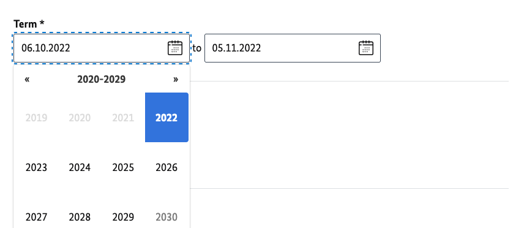

**Options:**

- Intro text
- Help text
- Validation (e.g. mandatory field, possible time span)

### File upload

Function for uploading files (Front-end view)

Validation options (e.g. mandatory field, number, permitted file format(s))

**Note:** The data upload in the form is a two-step process. Users select a file from their hard drive, which is displayed by name. Then they have to confirm the upload. Only when the page is saved will the data be stored in the database.

### Create options for selection fields

For selection fields, such as checkboxes etc., corresponding lists must
be created in advance under "Options".

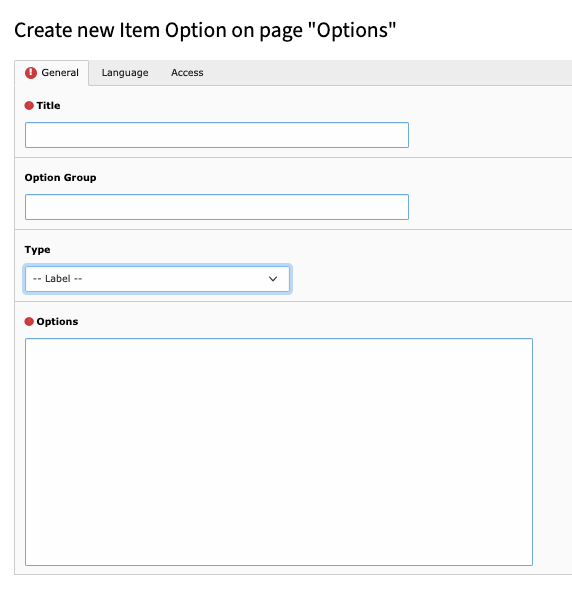

### Radio buttons

Single selection with radiobuttons (Front-end view)

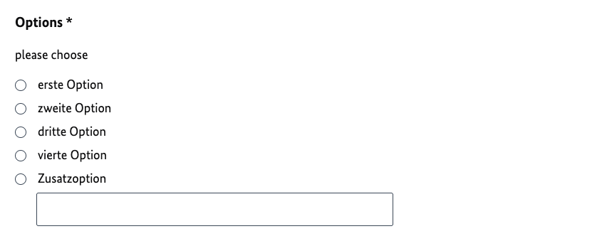

If "radiobutton" is selected as the type in the backend, a previously created option must be selected with the list of checkbox labels.

An additional selection point is possible where the user can freely enter something.

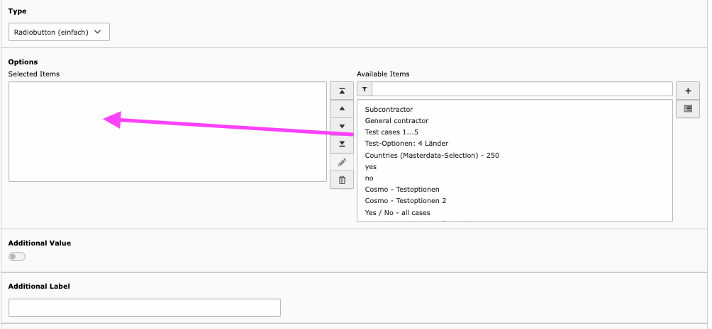

### Checkboxes

Multiple selection with checkboxes (Front-end view)

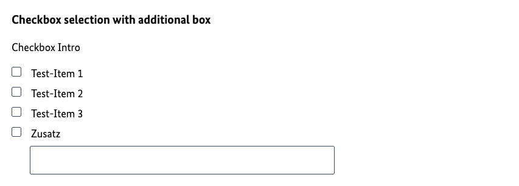

If "checkbox" is selected as the type in the backend, a previously created option must be selected with the list of checkbox labels.

An additional selection point is possible where the user can freely enter something.

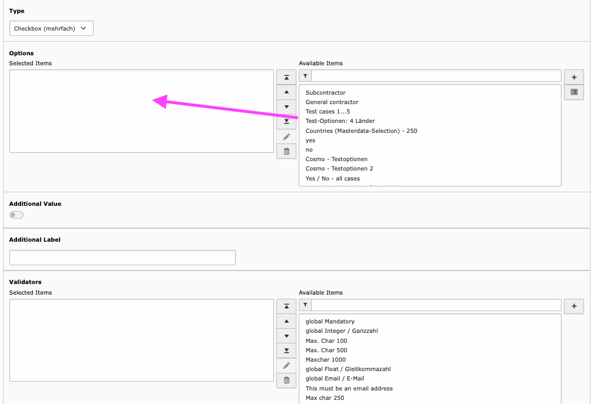

### Select Dropdown

As item type there is the option "Dropdown-Select" which results as a native html select box.

As options you can choose from available items (e.g. country list). Validators can be added as well.
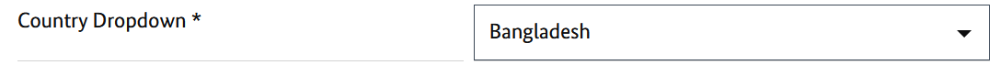

### Select field

Single or multiple selection with selectbox for long lists (Front-end view)

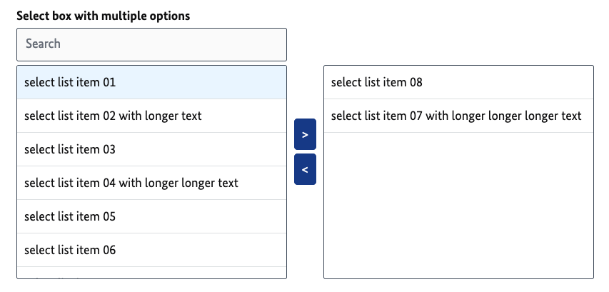

If "Select (multiple)" or "Select (single)" is selected as the item type in the backend, the previously created options can then be selected from the list of Available items.

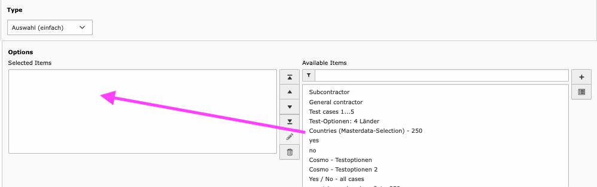

The order in this list then also corresponds to the output.

How to create options is described in [Create options](#create-options-for-selection-fields).

### Default from master data

Default values from the master data can be entered in text fields. These can then be overwritten when filling out the form.

As default, the respective variable is written with @ as prefix: e.g. `@applicant.companyEmail`

Here is the list with the available values:

- `@applicant.companyEmail`
- `@applicant.firstName`
- `@applicant.lastName`
- `@applicant.address`
- `@applicant.country`
- `@applicant.telephone`
- `@applicant.email`
- `@applicant.zip`
- `@applicant.city`
- `@applicant.www`
- `@applicant.company`
- `@applicant.salutation`

### Data transfer for succession call

Only optionally available in OAP!

**Note:** This special function is only relevant if entries from an already successfully submitted application of a previous call are to be taken over.

If data from a previously submitted request of a predecessor call is to be taken over in an item, the field is filled with the call ID and the item ID. The notation at this point is then

`<call-id>.<item-id>` e.g. `.58.104`

Here, the content of a submitted request based on the call with the ID 58 is taken from the item with the ID 104. The transfer cannot take place in nested or repeated groups.

The set-up of the call for this option is described in chapter "[Call with data transfer](#special-function-call-with-data-transfer)".

### Special items / Meta-Settings

Under the tab "Meta-Settings", special settings can be made for items.

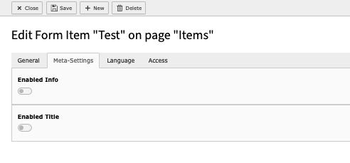

**"Enabled Info"**

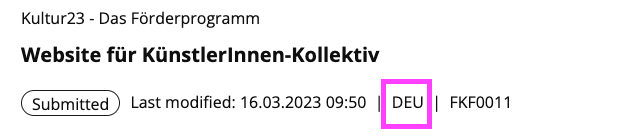

In the dashboard, users can see some information about the proposals they have created (e.g. date and ID). If "Enabled Info" is activated for an item in the backend, the field entry is displayed here.

**"Enabled Title"**

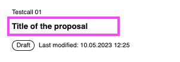

For a simple input field of a call with the project title, "enabled title" must be set here. This field entry is then displayed as the title of the proposal (in the dashboard, in the form header, in the backend, etc.). Please ensure that only one field per call is defined as "Title".

**"Enabled Filter"**

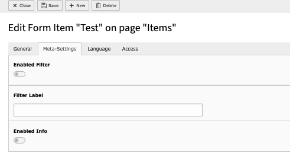

For selection fields, there is the option to use this as a filter option for submitted proposals in the backend. A label for the filter can be entered.

### Query before submit

For the summary page, queries should be created to obtain consent, e.g. for data processing, before submission.

For this purpose, at least one or more individual checkbox items are to be created, which can then be assigned during the call.

On the summary, the submit button is only activated when all these checkboxes have been confirmed by the user.

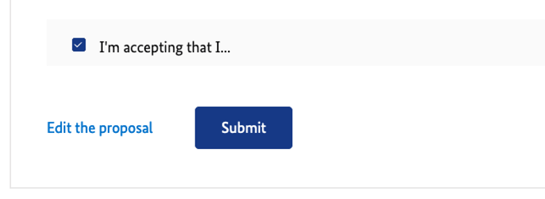

Frontend view

### Option: Hierarchical sorting

If you work with a lot of calls, sorting the items into subdirectories can help.

Example: create a new subfolder by drag and drop and create the items for a new call here.

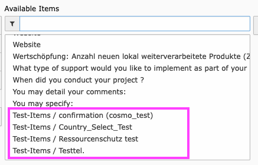

The subdirectories can then be found at the bottom of the list when selecting items.

### Groups

Groups contain items (=questions/topics)
In the group records, the items are added and sorted.

Groups can be created in a repeatable way, so that those completing the form can add further instances of the group in the form as needed. For example, to add contact details for different project partners.

In addition, it is possible to define "meta groups" that can contain different groups. For example, it is possible to combine a group with input fields and a table group (see below) in a meta group in order to create them as a repeatable package.

#### Creating a group

To create or edit groups, please select "List" in the side menu and then click on "Groups".

Please chose then "+" New Record" in the headline bar on the right side of the page.

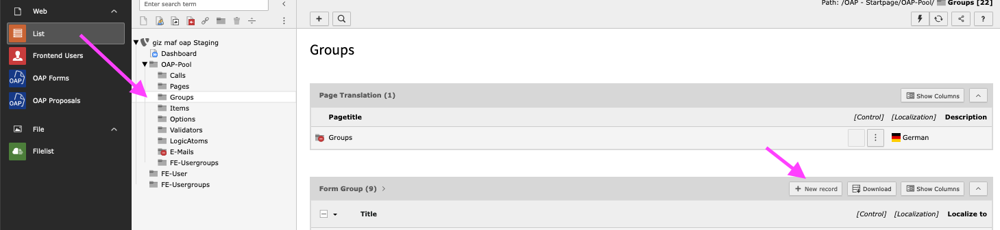

**Note:** As with items, subdirectories (e.g. per call) can also be created here. Drag and drop the folder symbol into the "Groups" directory.

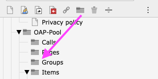

#### Form view for creating a group

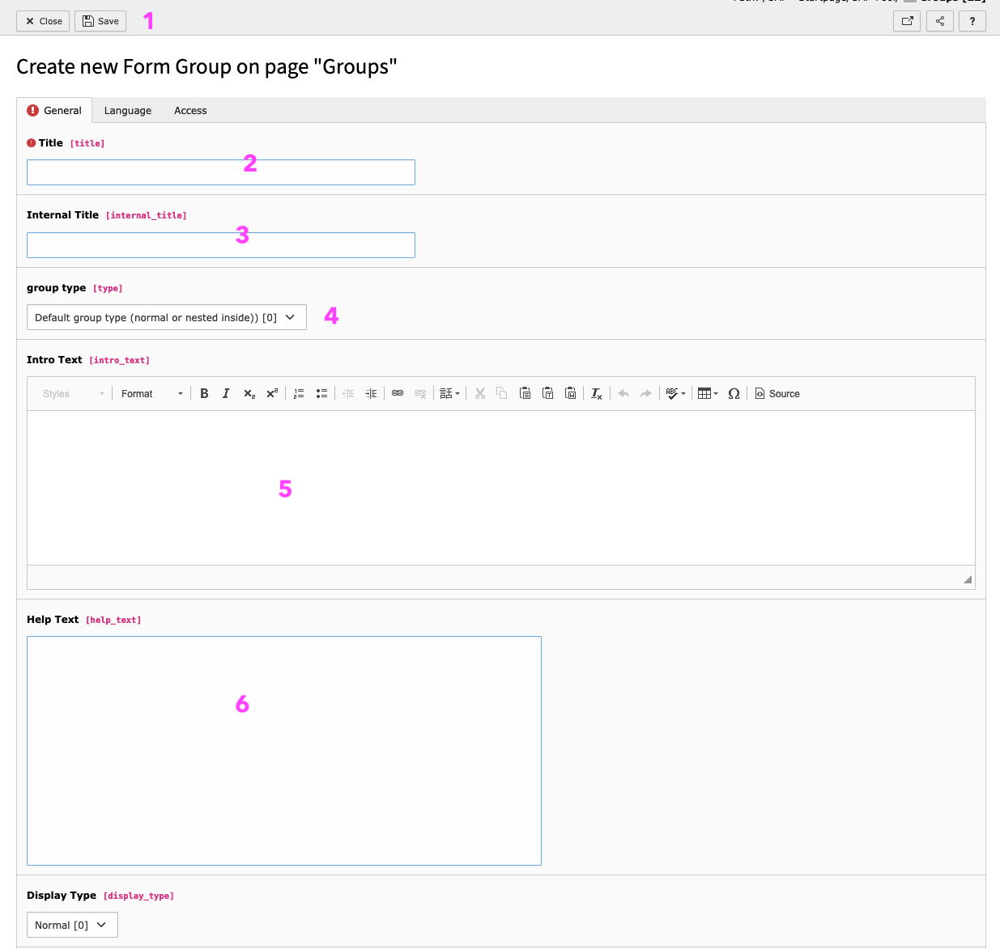
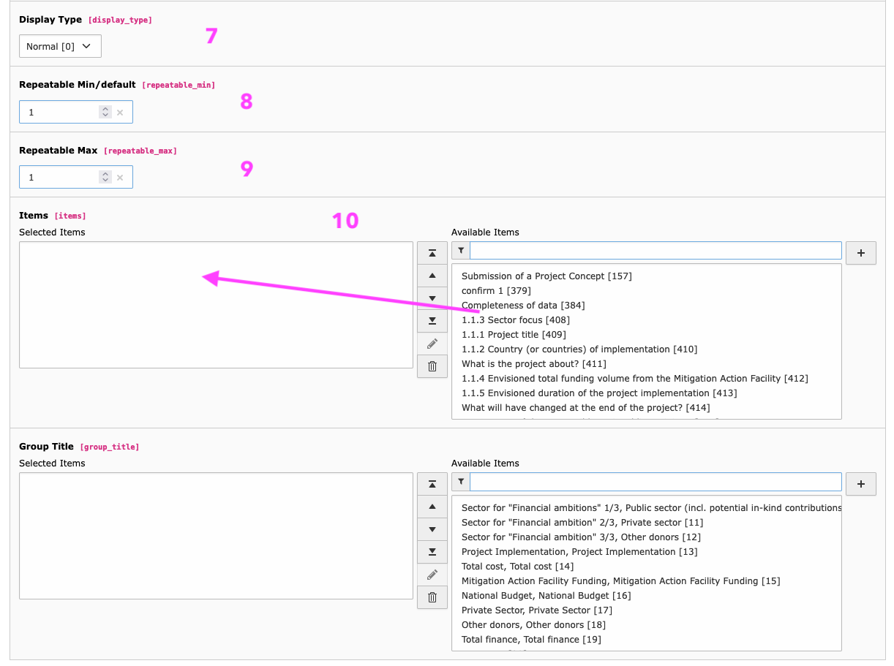

1. **"Save"** – please save after creating the group

2. **"Title"** – Headline for the group (mandatory)

3. **"Internal Title"** – a title used only in the backend can be assigned, which facilitates the assignment and selection of the groups

4. **"Group type"** – Selection [normal group](#normal-group) or meta group (see later)

5. **"Introtext"** - An introductory text can be entered here, with information on the following group. (optional)

6. **"Help Text"** - A help text can be optionally created, which can then be unfolded in the form if required.

7. **"Presentation form"** – Selection of whether the group is to be displayed normally or as a table (see next chapter)

8. **"Repeatable Min/default"** - Specifies whether the group should repeat and the minimum number of interactions to be displayed in the form.

9. **"Repeatable Max"** - Specifies the maximum number of times the group can be added in the form

10. **"Items"** - From the list of available created items, the ones that are to be grouped together must be selected.

#### Normal group

If "normal" is selected as the group type and presentation form, all items are displayed subordinate to each other in the selected order (Front-end view).

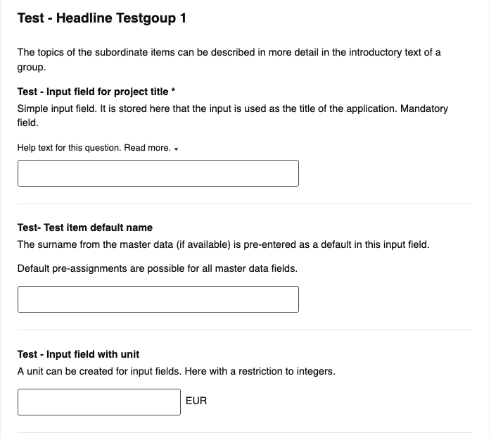

#### Table (Group)

Special group element for tabular presentation. (Front-end view).

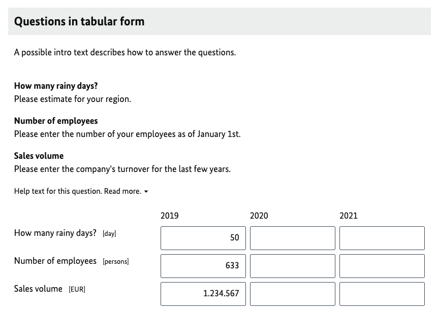

#### Form view for creating a table (group)

In the backend, the following settings are to be created in a group:

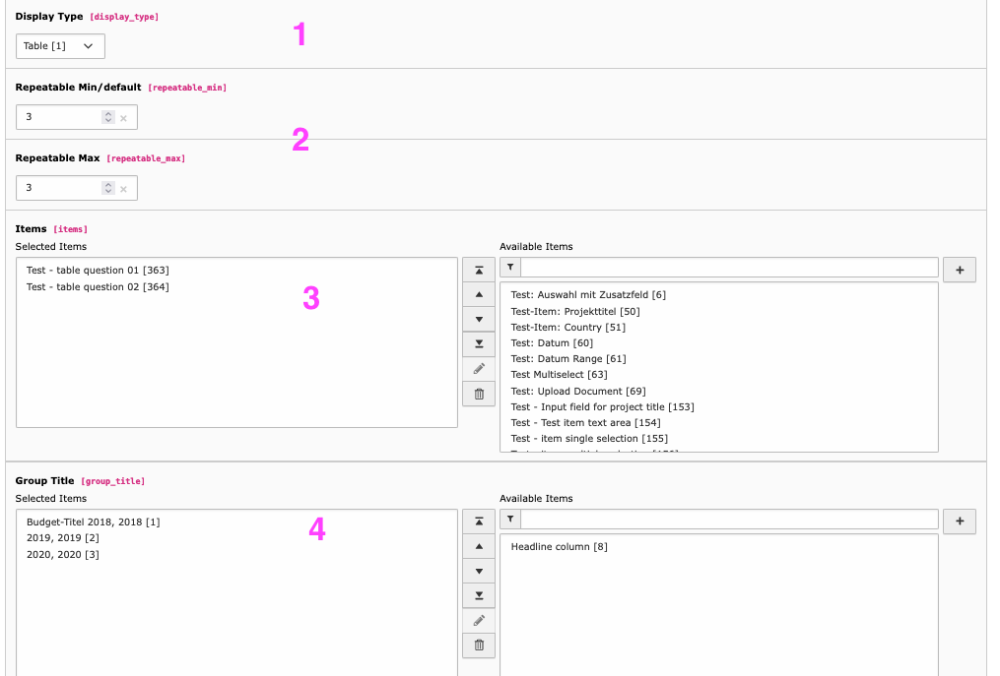

1. **"Display Type"** – Table

2. **"Repeatable Min + Max"** – Setting the number of columns (in this example 3) - 1 to a maximum of 4 columns are possible.

3. **"Items"** - Selection of the previously created available simple input fields. Only simple text fields are possible! The number of selected items then corresponds to the lines

4. **"Group Title"** - Column headings can be selected if required. The order is then output from left to right above the columns. Column headings are created on the overview page of the groups in the "Group Title" area.

    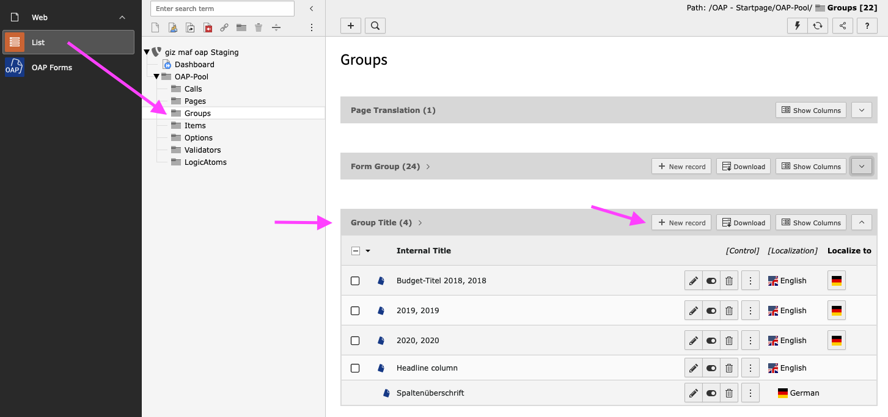

#### Meta group

A special group variant is the meta group. In this meta group, groups can be nested together/into each other.

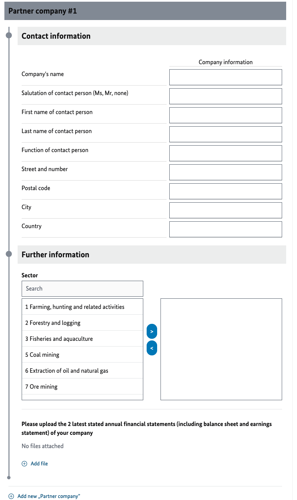

In this example, two groups are subordinate to the meta group. And the meta group can be added multiple times by the user to create multiple partners here.

#### Frontend view - example meta group 1

Form view for creating a meta group

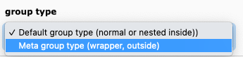

If "Meta group type" is selected at the top, the fields change at the bottom of the editing view.

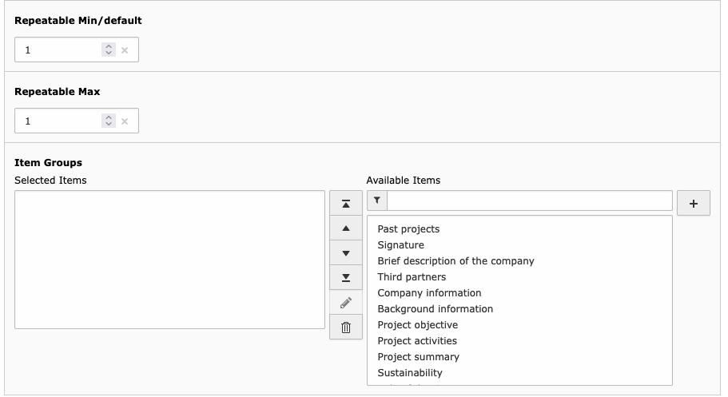

All created groups are available for selection under "**Available Items**". Here you select what is to be subsumed under the metagroup.

Both normal groups and table groups can be selected.

**"Repeatable Min"** determines how often the metagroup is displayed.

With **"Repeatable Max"** it can be selected up to which number the users can additionally add the metagroup.

If there are several metagroups, it is helpful if no groups are selected in which default values are in items.

### Pages

A form consists of at least one page that contains groups.

Please select List – Pages in TYPO3 Backend:

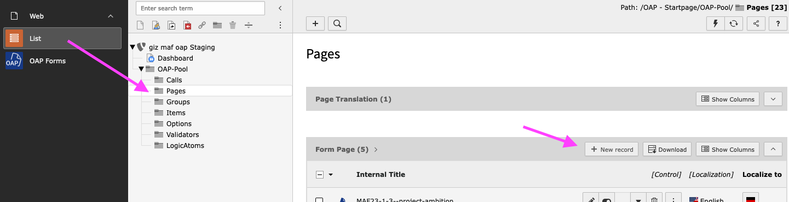

**Note**: Subdirectories (e.g. per call) can also be created here.

#### Form view for creating a page

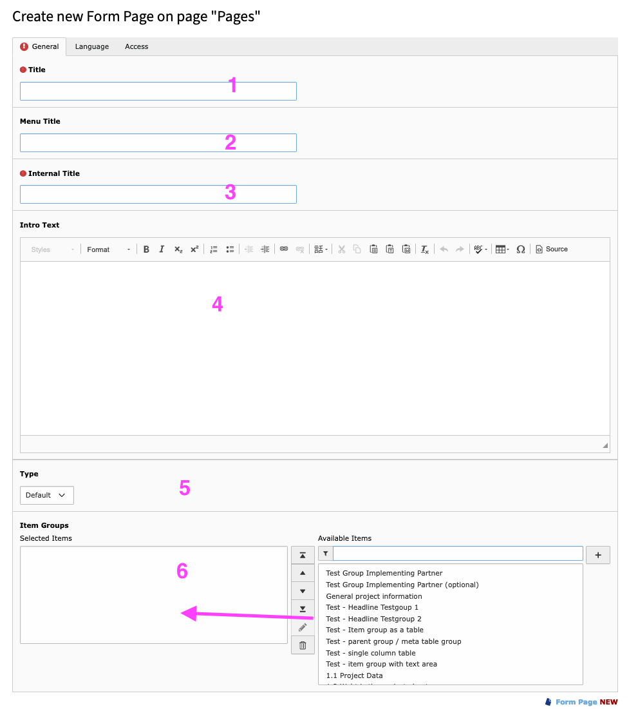

1. **"Title"** - The title is displayed as the heading of the page (mandatory)

2. **"Menu Title"** - Optionally, an abbreviated title can be defined. This is then displayed in the form as a navigation point for the page.

3. **"Internal Title"** - The internal title is only used in the backend and is intended to simplify the selection of pages

4. **"Intro Text"** - An introductory text can optionally be created for the page

5. **"Type"** - Please always select "default" first

6. **"Item Groups"** - From the groups created, you select here which are to be displayed on the page.

### Modificators

With modificators you can implement relationships between form fields

#### Form view for creating a modificator

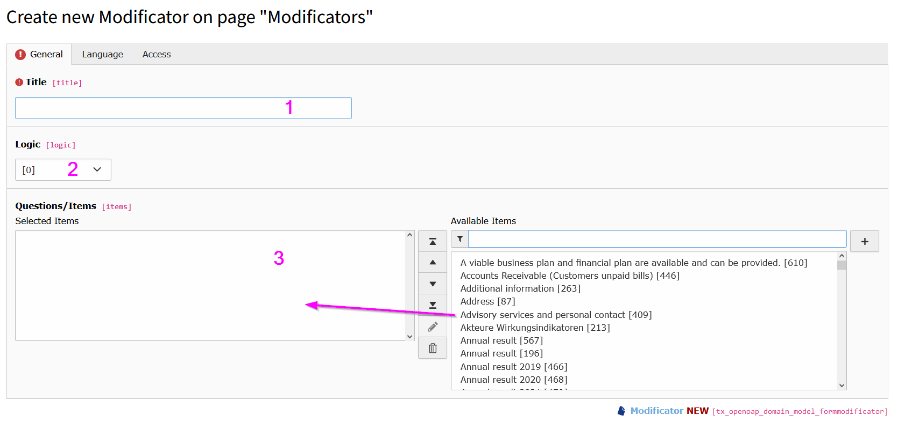

1. **"Title"** - The title is displayed as the heading of the modificator (mandatory)

2. **"Logic"** – The script logic has to be selected here

3. **"Questions/Items"** – Add here the items, which will have a relation to your item, which will become this modificator

Modificators can be added to items like validators. An example would be to implement an item which will show the sum from other fields. Doing this, you will need a modificator with a script logic (2), which sum up all selected items (3) and shows the sum in a chosen item, maped with the modificator.

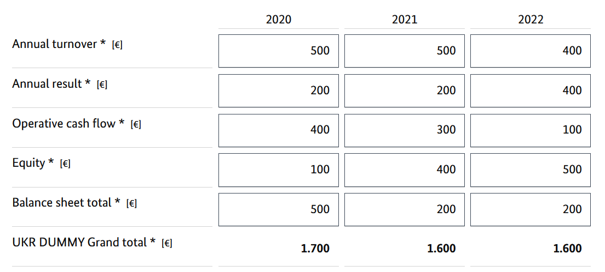

## Creating a call group
This is the top group for calls

Select "List" in the left navigation column and then "Dashboard Groups" in the directory tree

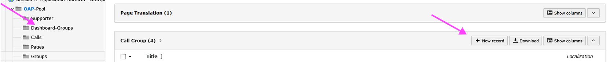

To create a new call, click "+ New Record".

The following functions are available in the list of existing call groups:

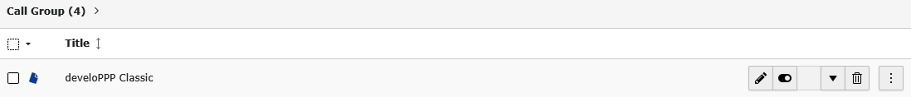

#### Form view for creating a call group

1. **"Title"** - The title is displayed as the heading of the call group

2. **"Description"** – The description is displayed as the description of the call group

3. **"GIZ Country Info"** – ?

4. **"DEG Country Info"** – ?

5. **"GIZ Basis Call Name"** – ?

6. **"DEG Basis Call Name"** – ?

7. **"Not accessible with these languages in the frontend"** – Language versions can be deactivated

## Creating a supporter

This is categorization of the calls in the call group

Select "List" in the left navigation column and then "Supporter" in the directory tree

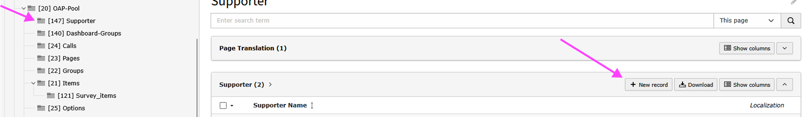

To create a new call, click "+ New Record".

The following functions are available in the list of existing supporter:

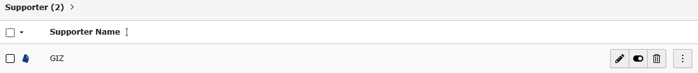

#### Form view for creating a supporter

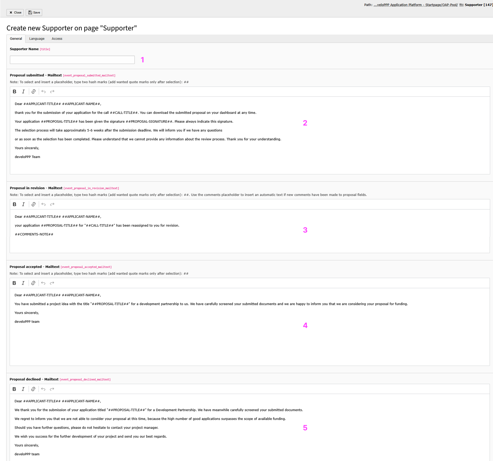

1. **"Supporter Name"** - The Supporter Name is displayed as the heading of the supporter

2. **"Proposal submitted - Mailtext"** – Mailtext for submitted proposal

3. **"Proposal in revision - Mailtext"** – Mailtext for proposal set in revision

4. **"Proposal accepted - Mailtext"** – Mailtext for accepted proposal

5. **"Proposal declined - Mailtext "** – Mailtext for declined proposal

## Creating a call

This is the top item and thus corresponds to the form itself, but also contains data on the course of the call (start time. end time - if required), logo data, e-mail etc.. )

In this data set, pages are added for the form.

Select "List" in the left navigation column and then "Call" in the directory tree

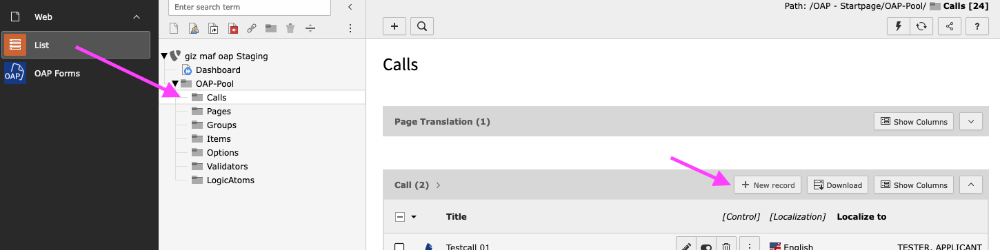

To create a new call, click "+ New Record".

The following functions are available in the list of existing calls:

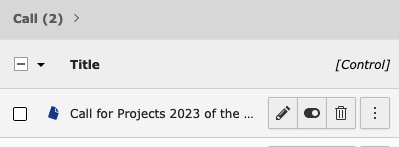

| Field | Description |
|-------|-------------|
| 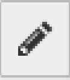 | edit call |
| 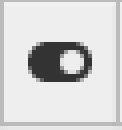 | call is active, function: "Hide record" |
| 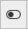 | call is inactive, function: "Un-hide record" |
| 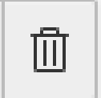 | delete call |

**Note:** A call should not be deleted lightly or changed after it has been started.

All data of the created and submitted applications refer to the data fields of the call form and may otherwise no longer be usable.

### Form view for creating a call

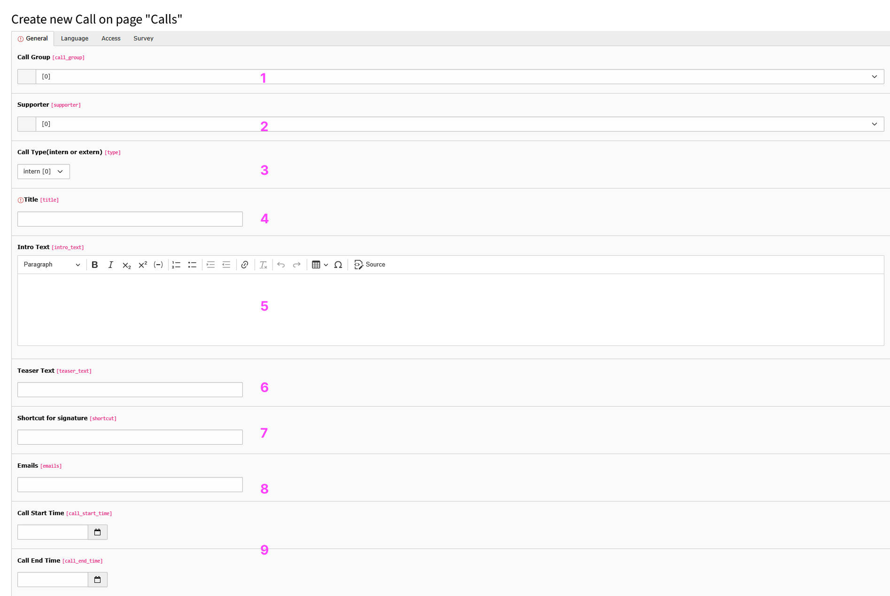

1. **"Call Group"** – The previously created call groups are now selected here.

2. **"Supporter "** – The previously created supporters are now selected here. Extern links are used to link to a extern webpage.

3. **"Call Type(intern or extern)"** – The possibility to set the call to a specify type
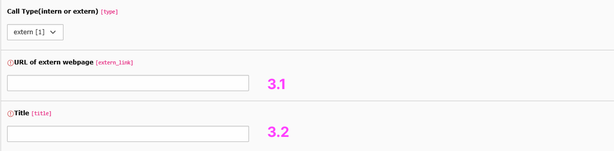

    1. **"URL of extern webpage"** - Url of the extern webpage
    2. **"Title "** - Title of the extern call in the dashbaord view

4. **"Title"** – Name/title of your call (mandatory)

5. **"Intro Text"** – The introductory text for the call is displayed above the first page of the form. (optional)

6. **"Teaser Text "** – The teaser text is displayed with the title in the dashboard when selecting the application form

   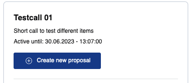 *(Frontend view)*

7. **"Shortcut for signature"** – Each submitted proposal receives an ID that is incremented. An abbreviation can be defined here, which precedes the number.

8. **"Emails"** – E-mail address(es) that should receive system messages.

9. **"Start Time / End Time"** – A call must have a start date and optional an end date! If set an end time the call will be restricted for creating a new call (not shown in the dashboard) and updating an existing call (no longer editable).

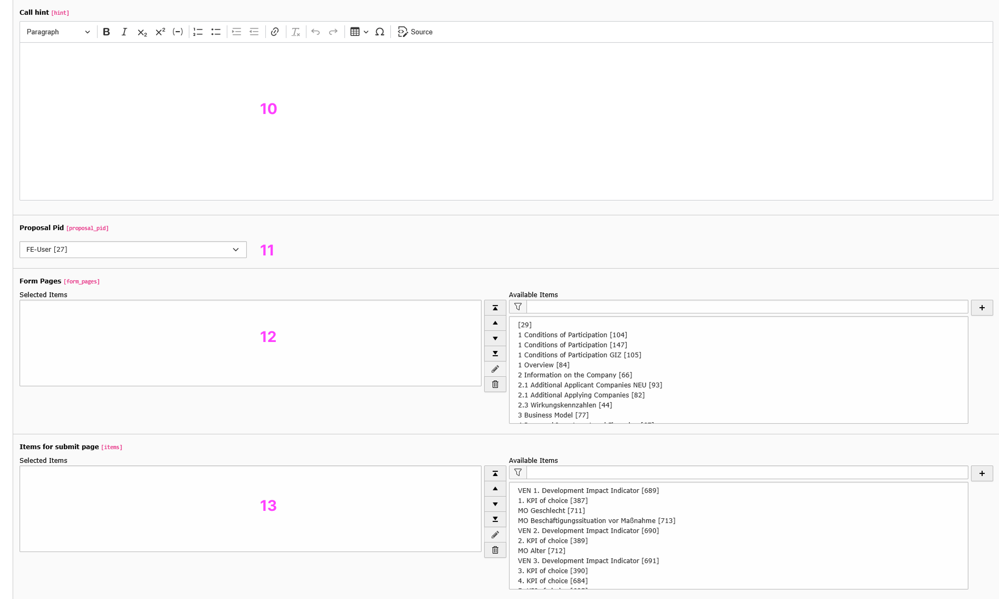

10. **"Call hint"** – ?

11. **"Proposal Pid"** – A separate directory can be created for each call, where the submitted proposals are stored (optional, see next chapter).

12. **"Form Pages"** – The previously created pages that are to form the application form are now selected here. The pages are then displayed in the order selected here in the frontend. The last page is always the submit page

13. **"Items for submit pages"** - Here, previously created items can be selected with a single checkbox, which is displayed under the summary

**Note:** at least one checkbox item is required here

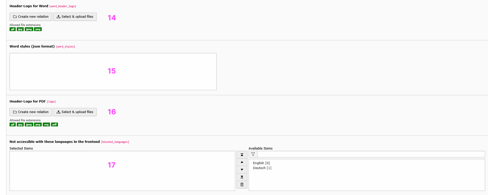

14. **"Header-Logo for Word"** – An image file with logo can be uploaded here, which will then be displayed in the header of the Word document.

15. **"Word styles"** – The default formatting of the Word files is stored in JSON format. Individual sections can be displayed and edited in the data field. It is strongly recommended that only qualified staff edit this data.

16. **"Header-Logo for PDF"** – An image file can also be uploaded as a header logo for the PDF of the form

17. **"Not accessible with these languages in the frontend"** – Language versions can be deactivated

### Proposal Pid

This is the filing directory for the submitted applications.

We recommend creating a separate directory for each call.

**Note**: For data protection reasons, the right to create Proposal data directories is restricted and should only be edited by admins!

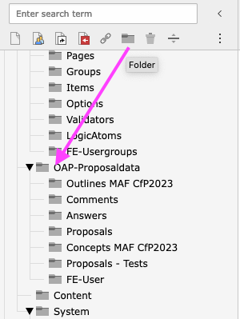

Drag the folder icon from the top bar into the directory with the OAP Proposaldata. And then assign the desired name.

### Preview

To check all contents of a created call in the overview, use the preview function under "OAP Forms" and select the directory "Call".

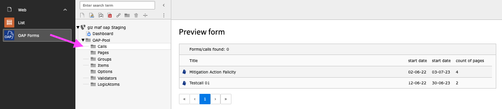

After selecting the corresponding call, all pages, groups and items are displayed with all texts:

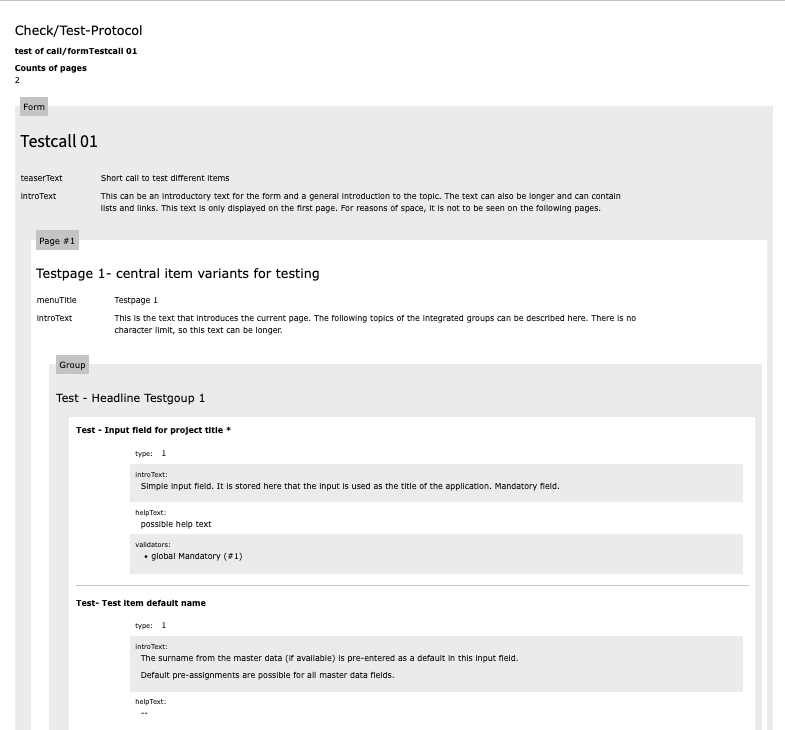

### Checklist

Please check the most important settings of the call:

- It's exactly one input field that has been set for the proposal title? (see 3.1.2 Special items / Meta-Settings)

- Is a start (and end) date defined?

- was the submit page inserted in the call and placed in the last position?

- Has one or more checkbox questions been defined for the summary and selected in the call?

- Is the call active?

### Testing and starting a call

Registered frontend users can be assigned a group "TESTER" (not created here in the example by selected items). If this group is also assigned to the call, the test users can check the call even if it has not yet been started.

Only when the call has been set to "visible" does it become selectable in the dashboard – for testing or when the start date has begun.

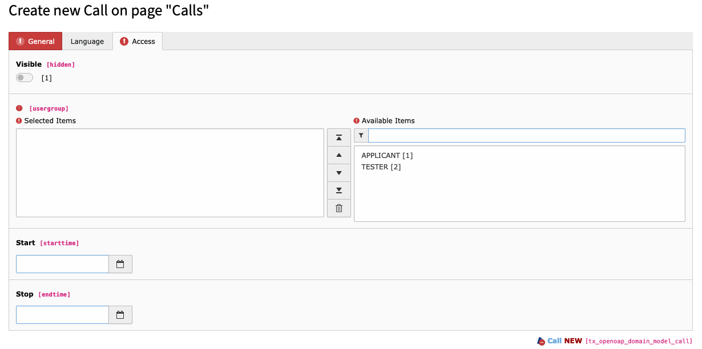

### Create a new call based on an existing call

**In the list view of the calls, a call is copied to the clipboard and then pasted again. Afterwards, the data of the call can be adjusted.**

The copy function can be found in the context menu (three dots).

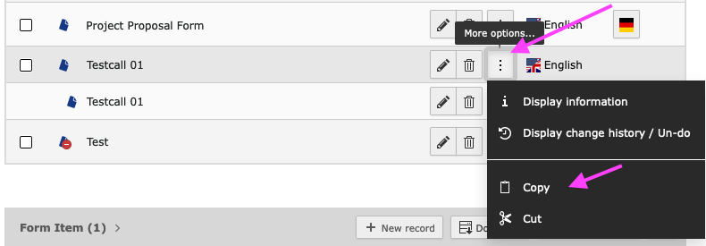

In the section "Clipboard" you can see the copy

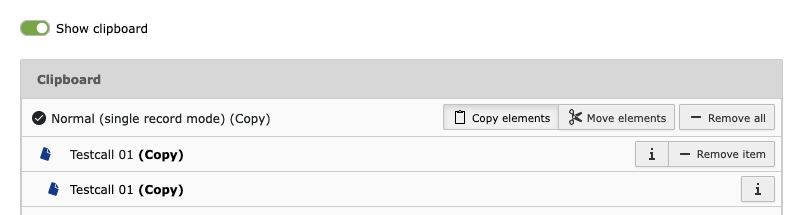

Then, using the function above "Paste clipboard content", the copied call is inserted into the list.

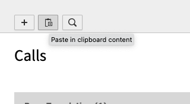

### Special function "anonymous survey"

Only optionally available in OAP!

The aim of this addition is the possibility of anonymous surveys. These can be conducted, for example, after an application process.

In order to guarantee anonymity (and to make it visible to the outside), no login should be required for the survey. The basic concept of oap so far has been that there is basically one user (= applicant) and each form is started from the personal dashboard. This also meant that everything was done after a login.

The new function makes it possible to call up a form with the survey call id as a parameter:

**https://oap.xxxx.de/survey?survey=78&hash=456**

- "Survey" is the name/alias of the page.
- The parameter "survey" passes the ID of the call (here 78)
- The parameter "hash" passes the individual code

After the call, a new proposal is assigned to the anonymous user and the form is started.

The form is processed according to the normal rules, with the following exceptions:

1. There is no close function (this button is hidden for anonymous surveys) .

2. Cancel leads to termination and no data is transferred (in principle, the data remains in the system as a draft) .

3. No e-mail is sent after the submit (at present). This can be realised more easily after the e-mail handling has been modified.

4. After the submit, the user is forwarded to a thank you page.

5. In case of a close ("Cancel" button), the user is redirected to the cancel page.

The call record receives the new field (toggle field) "anonymous" in the **"Survey" tab**.

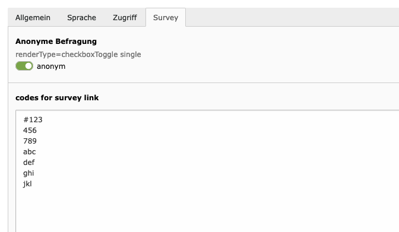

The freely definable codes can be stored here.

If a code was used by a submitted survey, it is automatically marked here with a hash.

**Requirements**

- **An anonymous system user**
  This user is created in advance, if possible in a separate pool folder (e.g. FE-User-Survey_anonymous), so that this user is not accidentally deleted or deactivated.
  The Id of this user is communicated via the constants:
  surveyOapUser: "Id of oap survey user (anonym)"

- **A form page**
  This page must be outside the login-protected page tree. The form plugin "oap form [openoap_form]" is required in the page.
  The page is entered as a survey form page with a setting in the constants:

  Page with proposal form (plugin) for survey
  plugin.tx_openoap_dashboard.settings.surveyPageId

- **A thank you page**

  The thank you page is called after the submit (instead of the normal redirect to the dashboard)
  The page is set with a constant:

  Survey page for saying Thank you after submitting survey
  plugin.tx_openoap_dashboard.settings.surveyThanksPageId

- **A cancel page**

  This is called after the Cancel (instead of the normal redirect).
  The page is set with a constant:

  Survey page reaction of aborting survey
  plugin.tx_openoap_dashboard.settings.surveyAbortPageId

### Special function "Call with data transfer"

Only optionally available in OAP!

For a multi-stage procedure, it may be useful for users to be able to transfer the contents of data fields of their submitted and accepted application to the following application.

Example: If users have already successfully submitted a "Concept" and in the following "Outline" call some of the same information has to be filled in again. In this case, the following call can be created with data transfer and is then displayed in the user's frontend directly with the submitted "Concept" proposal.

When creating the follow-up call, the following information must be entered in the form view for creating a call:

- The **existing call** requires the specification of the successor call

  

- The **successor call** knows its predecessor

  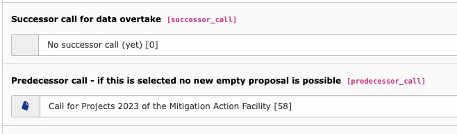

- The **successor call** is connected to a specially created user group that is activated for this call - in this example "outline".

  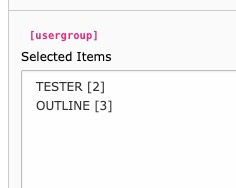

This call is then only available for this specific user group and for an application that has the status "accepted".

How to define the data fields for which a data transfer is to take place is described in chapter 3.1.13 "[Data transfer for succession call](#data-transfer-for-succession-call)".

## Edit email and website texts

### Define email texts

The definition of the system e-mails are listed in the Dashboard plugin.

> List - Dashboard - Dashboard Plugin

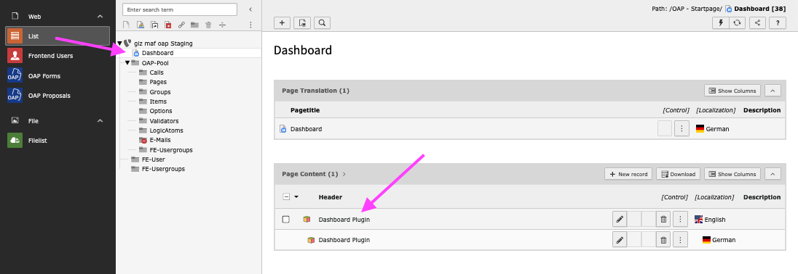

All e-mail texts are listed under the "Plugin" tab:

- Proposal submitted (Mail to user when proposal has been submitted)
- Proposal in revision (Mail to user when proposal has been reassigned to him for correction)
- Proposal accepted
- Proposal declined

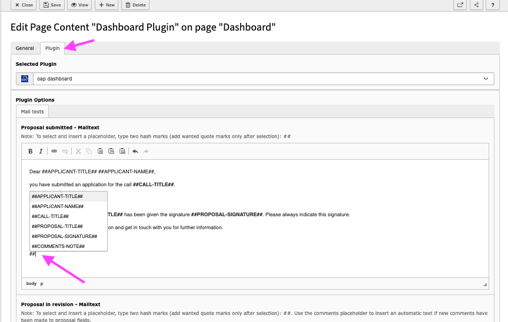

The mail texts can be freely defined. Available variables are displayed when # is entered.

### Editing static texts

With the appropriate authorization, the static texts can be edited in the backend, such as home page, imprint, contact, data protection.

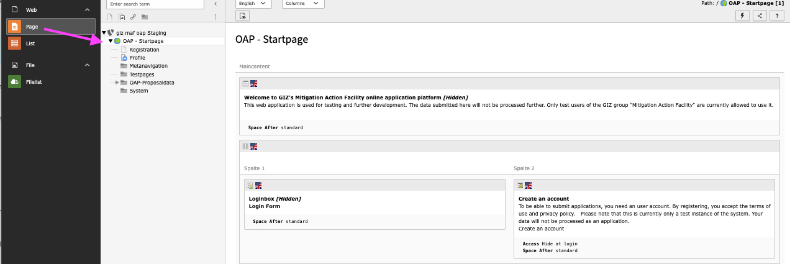

Select "Page" in the page menu and click on the desired page in the middle menu.

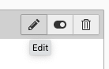

- To change a text, click on the edit symbol.
- The slider can be used to make a text field visible or invisible.
- The rubbish bin icon can be used for deletion.

  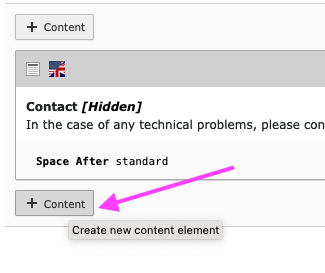

- A new text field is created with "+ Content".
