# Open OAP - Elements overview

**Status:** Version 1.1
**Date:** 12.01.2022

## Form structure

A call can consist of several pages. Several groups can be arranged on one page. There can be any number of elements/items in a group.

### Call

This is the top item and thus corresponds to the form itself, but also contains data on the course of the call (start time. end time - if required, logo data, e-mail etc..) In this data set, pages are added for the form.

Texts that can be deposited:

- Titel
- Intro text
- Teaser-Text – for the Dashboard

### Pages

A form consists of at least one page that contains groups.

Texts that can be deposited per page:

- Titel
- Menu title for Navigation

  If the page title is too long, a shorter version can be stored here for the menu.

- Intro text - introductory text on the form page

### Groups

Groups contain items (=questions/topics)

In the group records, the items are added and sorted.

Texts that can be stored for each group:

- Titel
- Intro text
- Help text

Groups can be created in a repeatable way, so that those completing the form can add further instances of the group in the form as needed. For example, to add contact details for different project partners.

In addition, it is possible to define "meta groups" that can contain different groups. For example, it is possible to combine a group with input fields and a table group (see below) in a meta group in order to create them as a repeatable package.

### Navigation

Navigation is via the page navigation with the page titles and the summary page. In addition, the toolbar is present at the bottom of the window with the functions

- Save and close or close only (back to dashboard)
- Save (stay on the page in the form)
- Save and go to next page

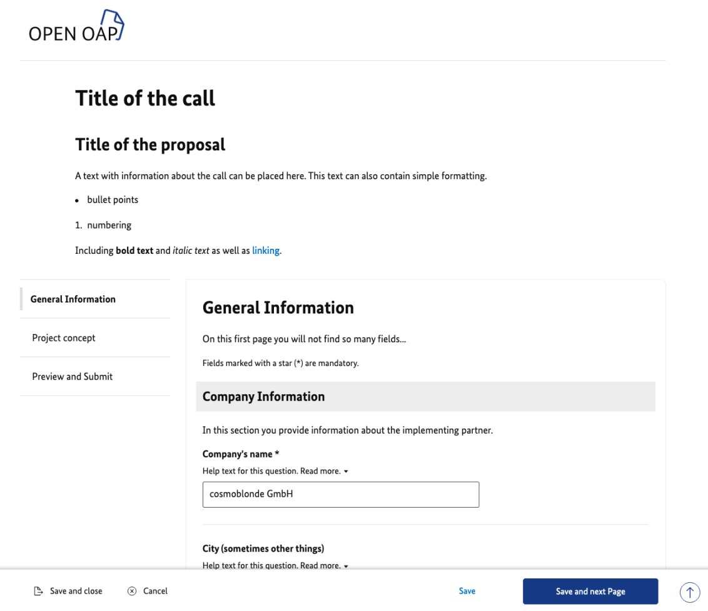

### Preview/Summary

By default, the last page is the preview of the questions and answers (entered values/texts) of the entire form.

Error messages may also be displayed here. The "submit" button only becomes active when all mandatory fields have been filled in.

With the submission, the status of the form is changed and is now no longer editable. Then the application can be viewed in the backend and exported.

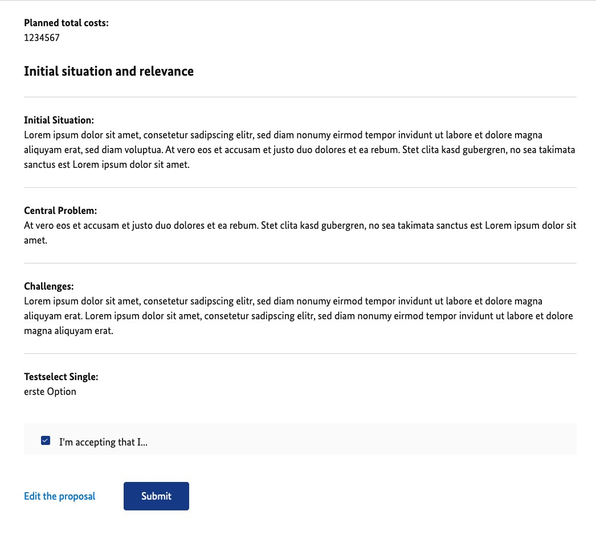

## Elements/Items

The items are the actual questions that can be created in different formats for the answers.

All items consist of a heading/question and input options. Optionally, intro text and help text can be added.

Fixed check criteria/validators can be assigned and lead to error messages when saving the form page. It is possible to specify certain items whose values are displayed in the dashboard.

### Text field

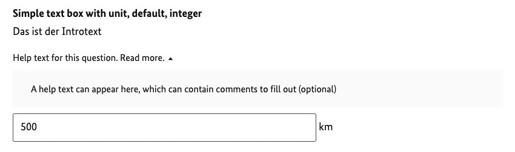

**Options:**

- Intro text
- Help text
- Unit
- Default value
- Validation (e.g. mandatory field, number, character length, etc.)

### Text area

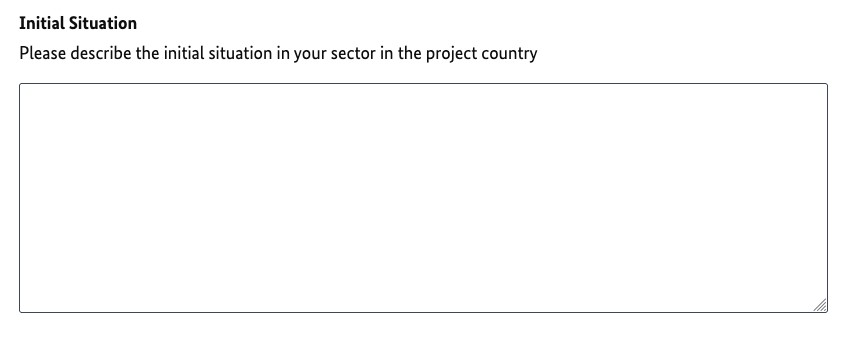

**Options:**

- Intro text
- Help text
- Default value
- Validation (e.g. mandatory field, character length, etc.)

### Date selection

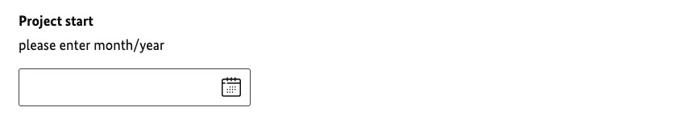

**Options:**

- Intro text
- Help text
- Validation (e.g. mandatory field, earliest possible date)

### Period

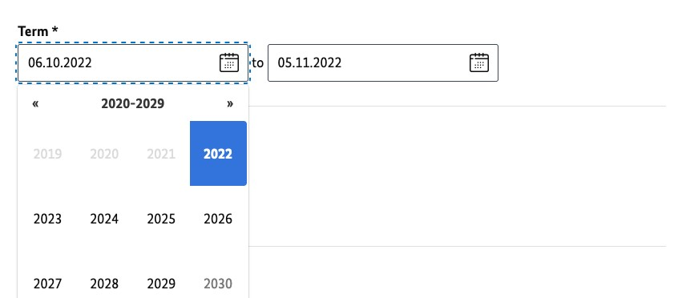

**Options:**

- Intro text
- Help text
- Validation (e.g. mandatory field, possible time span)

### Radio buttons

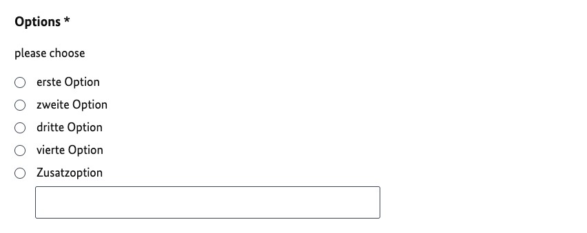

*Figure 7 – Single selection with radio buttons with additional field, mandatory*

**Options:**

- Intro text
- Help text
- Additional field with text input
- Validation (e.g. mandatory field)

### Checkboxes

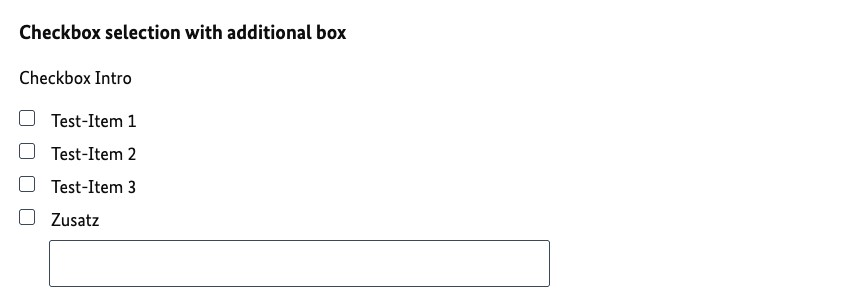

*Figure 8 - Multiple Selection by Checkboxes with Additional Field*

**Options:**

- Intro text
- Help text
- Additional field with text input
- Validation (e.g. mandatory field)

### Select field

Single or multiple selection with selectbox for long lists

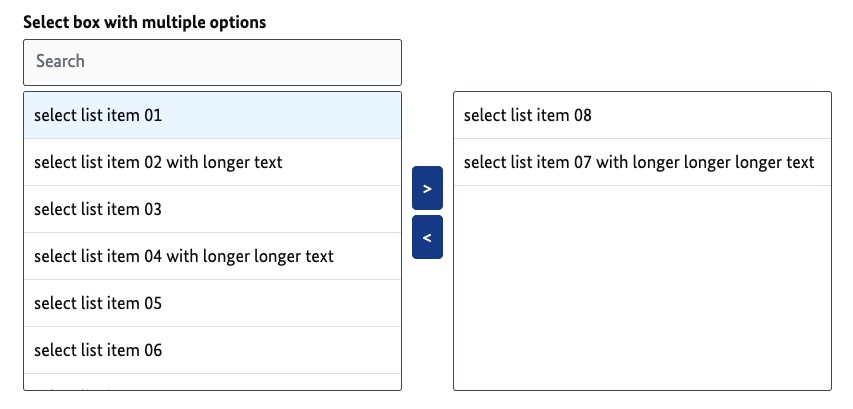

**Options:**

- Intro text
- Help text
- Validation (e.g. mandatory field)

### File upload

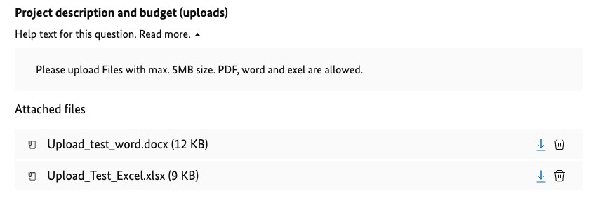

*Figure 10 – Upload funktion with help text and 2 uploaded files*

**Options:**

- Intro text
- Help text
- Validation (e.g. mandatory field, number, permitted file format(s))

### Table (Group)

Special group element for tabular presentation. 1 to a maximum of 4 columns are possible.

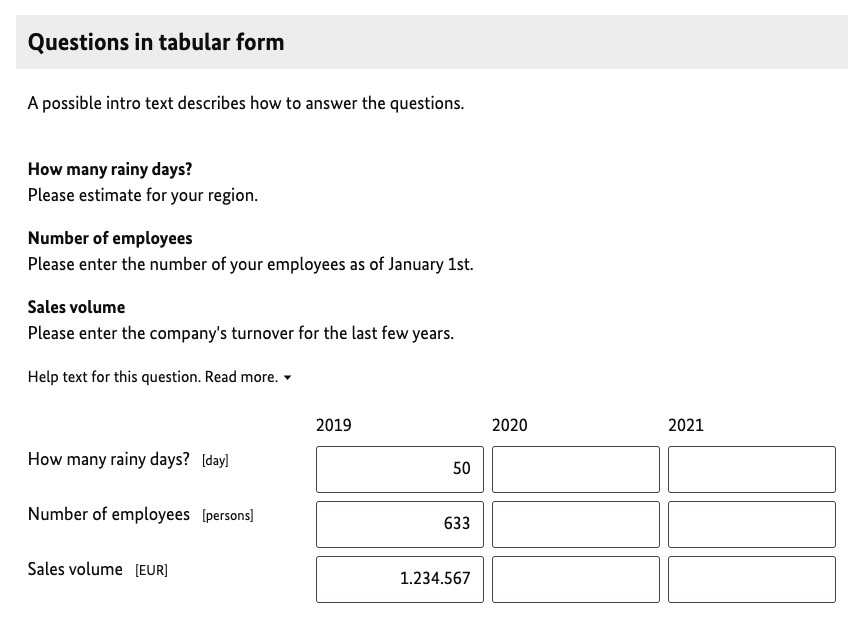

**Options:**

- Introtext Group
- Intro text per item (line)
- Help text per item (line)
- Validation per item (e.g. mandatory field, number format)

## General

### Access to the System

Registration and log-in (with existing access data) can be carried out via the start page.

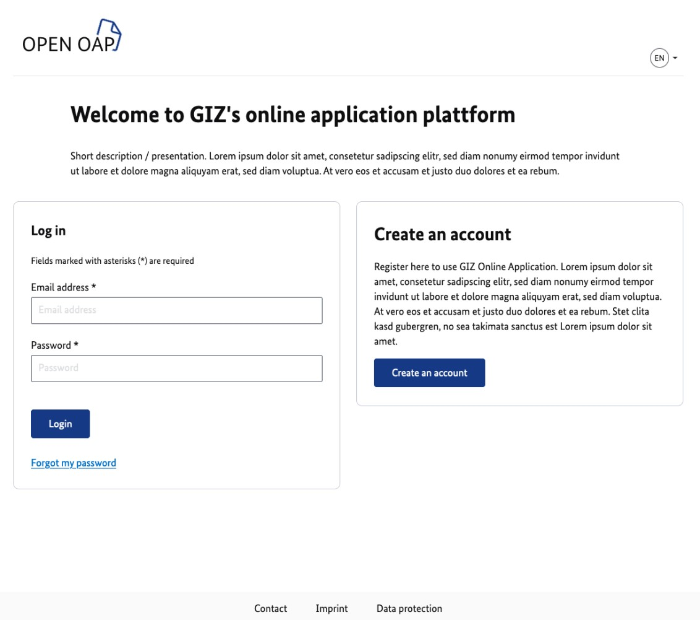

- Enter email address and agree to terms of use
- Link call in confirmation email received
- Assigning a password
- Optional: Enter company data/master data (later default transfer to forms)

### Dashboard

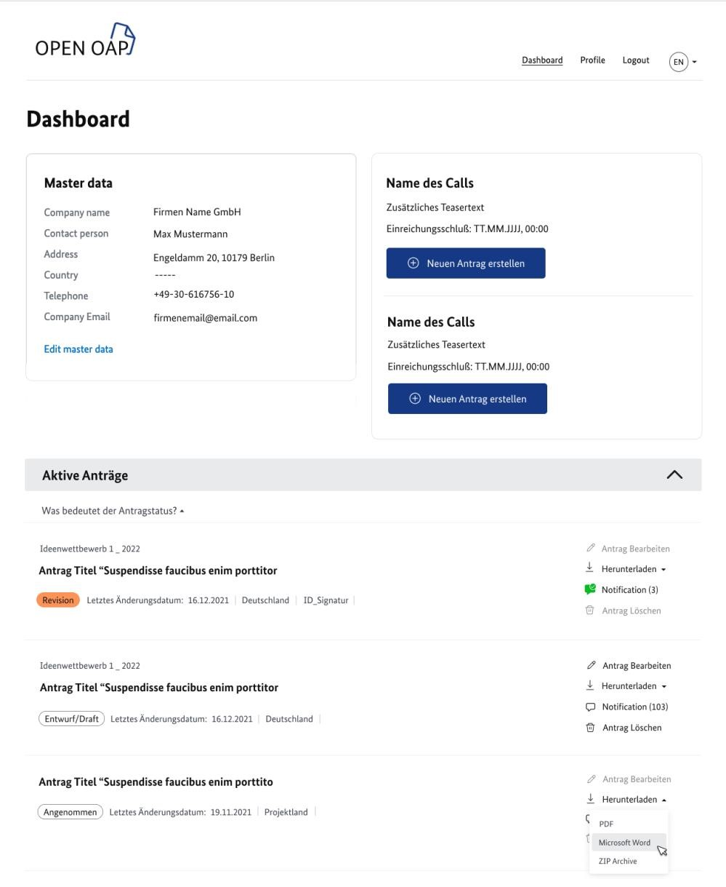

In the upper area, the master data is displayed and active calls can be selected to create an application.

If applications are created (draft) or submitted, in revision, etc., they are displayed with the most important data in the lower area.

Depending on their status, they can be edited, downloaded or deleted.

If submitted applications have been commented by editors, this is shown here and a notifications page with all status messages and comment notes can be displayed.

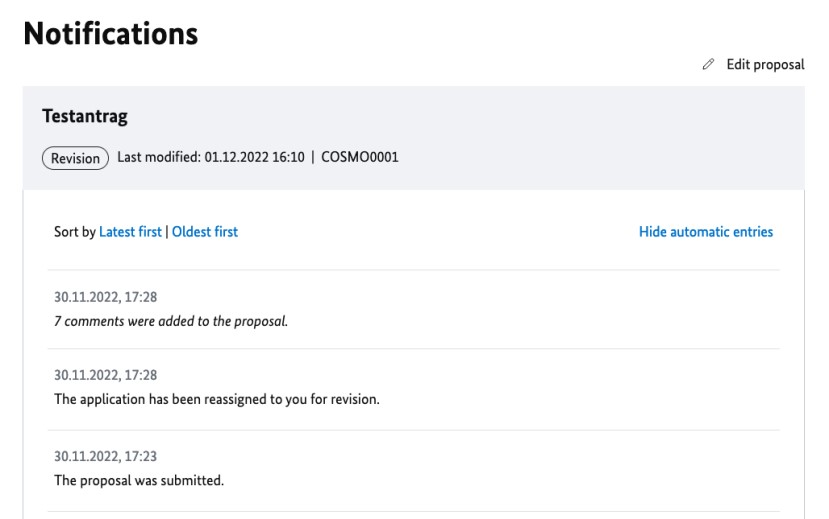

Commented form fields are specially marked in the "Revision" status when the form is called up again and the comment texts are displayed with the field.
