# Open OAP - Manual for Application Management

**Status:** Version 2.0
**Date:** 11.2025

## Overview

Once applications have been submitted, they can be managed in the TYPO3 backend. The TYPO3 backend  is accessible via the URL/typo3

Backend users with the assigned **role "clerk"** have access to the application management. For data protection reasons, clerks can only see submitted applications, not the drafts that applicants may have already created.

The OAP system offers the following possibilities:

- Viewing the registered users
- Viewing the applications received
- Commenting on applications or individual fields
- Changing the status of applications
- Export individual applications or a selection of applications
- Assessment funktion

## Registered Users

**To view the registered users, please select "Frontend Users" in the side navigation and then the directory "FE-User".**

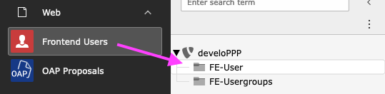

**A list shows all users who have registered on the OAP homepage to be able to submit an application.**

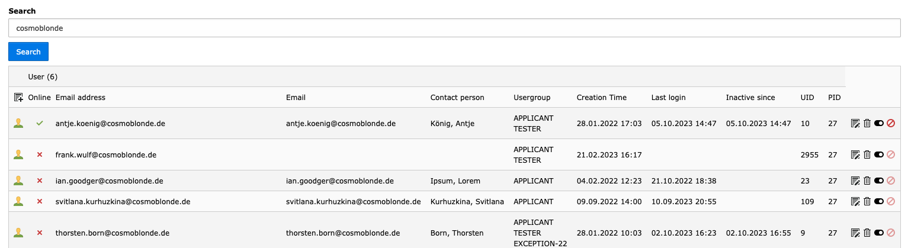

| Field                                                                                                                                                                                               | Description                                                                                                                                                                                                                                                                      |
| --------------------------------------------------------------------------------------------------------------------------------------------------------------------------------------------------- | -------------------------------------------------------------------------------------------------------------------------------------------------------------------------------------------------------------------------------------------------------------------------------- |
| Online                                                                                                                                                                                              | If a user is currently logged in, a green tick is displayed. Please note that this status is not always up-to-date due to technical reasons. As long as the user has not logged out, the system cannot reliably determine whether editing is still taking place in the frontend. |
| Email                                                                                                                                                                                               | E-mail address of the applicant / user                                                                                                                                                                                                                                           |
| Contact person                                                                                                                                                                                      | If a user has entered their name in the master data, they are displayed here                                                                                                                                                                                                     |
| Usergroup                                                                                                                                                                                           | By default, a registered user has the group "APPLICANT". It is possible to assign the group "TESTER" to users so that they can pre-test a call. Other special groups are possible                                                                                                |
| Creation Time                                                                                                                                                                                       | Date when the user registered                                                                                                                                                                                                                                                    |
| Last login                                                                                                                                                                                          | Time when the user last logged in                                                                                                                                                                                                                                                |
| UID                                                                                                                                                                                                 | (unique) ID of the account                                                                                                                                                                                                                                                       |
| PID                                                                                                                                                                                                 | Page ID, the storage location/folder                                                                                                                                                                                                                                             |
|                                                                                                      | Delete user                                                                                                                                                                                                                                                                      |
| 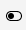 | User can be enabled or disabled                                                                                                                                                                                                                                                  |
| 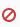                                                                                                   | it is possible to log out logged in users (Recommendation: this only in consultation with the user)                                                                                                                                                                              |

**Note:** If a user encounters problems, please check whether they have been assigned to the “APPLICANT” group. This must always be assigned so that a user can see calls and create proposals.

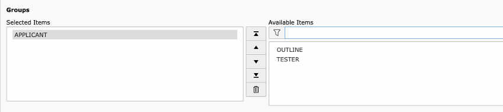

## Proposals

The submitted proposals can be found under the item "OAP Proposals" in the side menu. (It does not matter which item is active in the second column.)

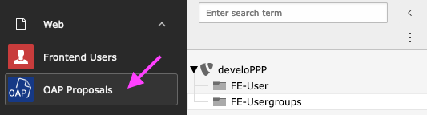

### Call selection

First, the desired call must be selected from the list

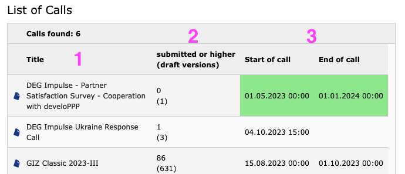

1. Title of the call

2. Number of applications that were submitted or processed. The number of drafts created is shown in brackets.

3. The start and end date of the calls are indicated here. If the area is highlighted in green, the call is active.

**List of Proposals of the selected Call**

After clicking on the title of a call, a list is displayed with all submitted (or higher status) applications.

View if no application has been submitted yet:

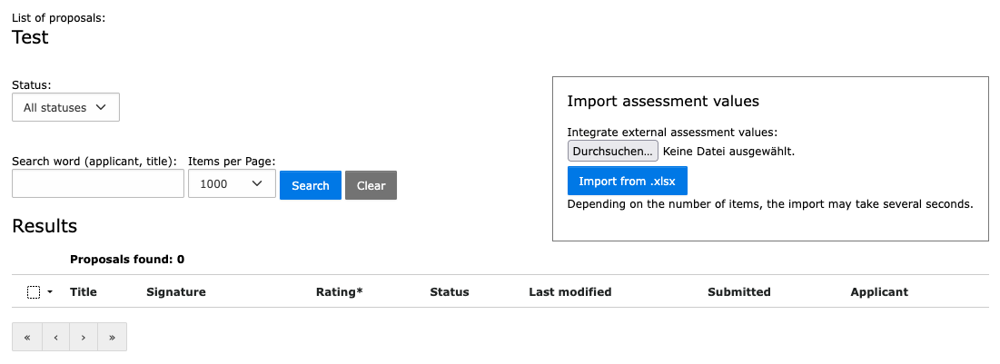

**Note:** The “Import Assessment values” function is only for specific OAP uses and requires a special Excel file.
Documentation is stored separately: “[ImportAssessmentValues](ImportAssessmentValues.md)”

View with submitted applications (older OAP version):

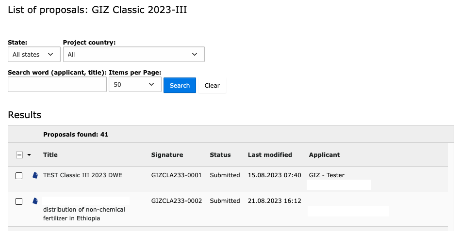

### Sort and filter

The list can be filtered and searched according to various criteria

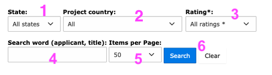

1. Filtering of applications according to status

2. If a selection field was marked as a filter, a corresponding selection option is found here

3. If an assessment (only optional in OAP) is planned, it can be filtered here according to the number of ratings

4. Search function

5. Selection of how many entries are displayed per page

6. Submit or reset search

**Sorting by columns**

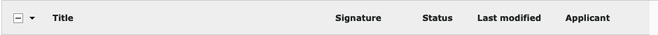

By clicking on a column title, the list can be sorted according to this title.

### Preview of the proposals

If an application were selected by clicking on the title, the preview of the application is displayed.

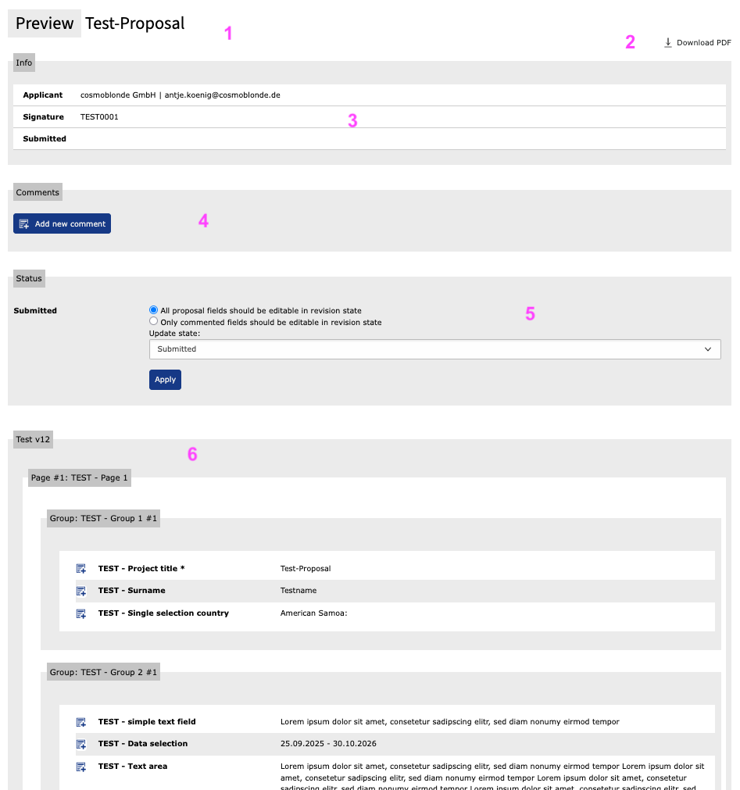

1. Title of the proposal

2. PDF export of the application

3. Short Info

4. Comment function see ["General comments"](#communicate-with-the-applicants)

5. Status changes see ["Status changes"](#_Status_changes)

6. Name of the call and view of all questions (left) and entered answers (right), structured in pages and groups

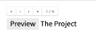

Pagination has been added so that you don't always have to go back to the list

### Communicate with the applicants

#### General comments

There is an option to write a general comment on the application.

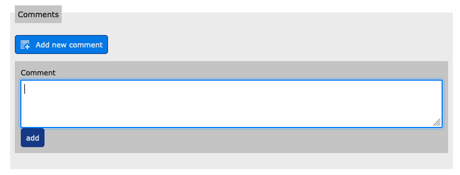

Clicking on the button "Add new comment" opens an input field. After entering the text, it is added as a comment by clicking on "add".

It is possible to write several comments.

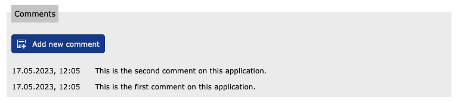

General comments are immediately displayed in the applicant's dashboard.

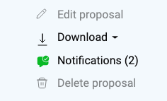

#### Field specific comments

There is also the possibility to comment on any field or answer.

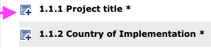

Clicking on the icon in front of each question opens an input field.

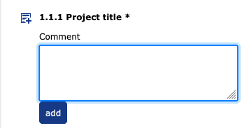

After entering a comment text and clicking on "add", the comment is saved at this field.

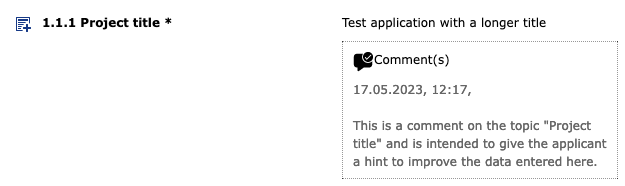

Here, too, any number of comments can be entered. In order to be able to better assign the communication, the logged-in "clerk" is indicated.

Field-specific comments are displayed to the applicant in their application and are thus only accessible once the application has been rejected to them. See status change "revision" in the next chapter.

### Status changes

An application always has a status. The following are possible:

- Draft - The proposal has not yet been submitted
- Submitted - The proposal was successfully submitted
- Revision/Re-opened - The proposal is in revision
- Contract - The proposal will be followed up
- Declined - The proposal will not be pursued

The statuses "Draft" and "Submitted" are set automatically by the system and cannot be selected editorially.

The status of an application can be changed individually or by batch processing.

The applicant receives an e-mail for each status change.

#### Status "Revision" / "Re-opened"

A submitted application may be reassigned to the applicant for revision.

This should be done finally when the field entries to be revised have been commented on.

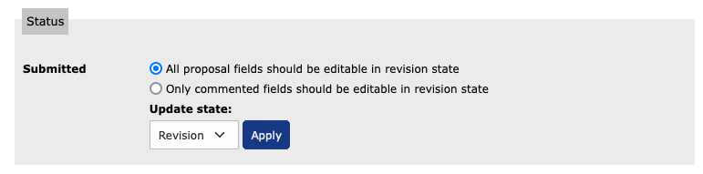

It can be selected whether the applicant is only allowed to edit the commented fields again or whether all application fields can be edited again (this may not be desired because they have already been checked).

When switching to "Re-opened", the standard emails for the topic are sent directly and the status of the proposals is set.

#### Status "Contract"/"Accepted" and "Declined"

If a submitted application is to be pursued or rejected after review, a corresponding status must be selected.

This can be done in the individual application preview.

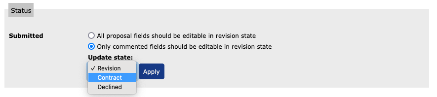

Or by selection in the application overview. Due to potential performance issues, we recommend a maximum selection of 100 elements.

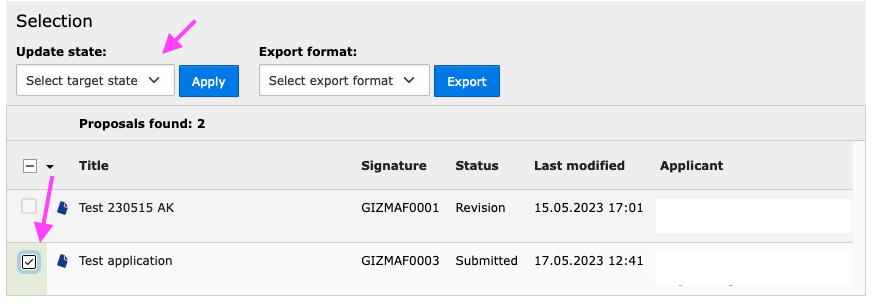

If one or more applications are selected in the list, the status selection is displayed at the top.

After selecting the status acceptance or rejection and "apply", a page is displayed where mail texts can be individualised. (**see below**)

**Note:** With "Declined" and "Accepted", the status is set regardless of whether the e-mail is sent. This means that it is no longer possible to send the e-mails at a later date, as proposals that have already been set to the target status cannot be set again and therefore no e-mail can be sent.
If it is necessary to send an e-mail at a later date, please ask the admin to help. The status is then first set to "submitted" again (which does not trigger an email) and the process can then be carried out again.

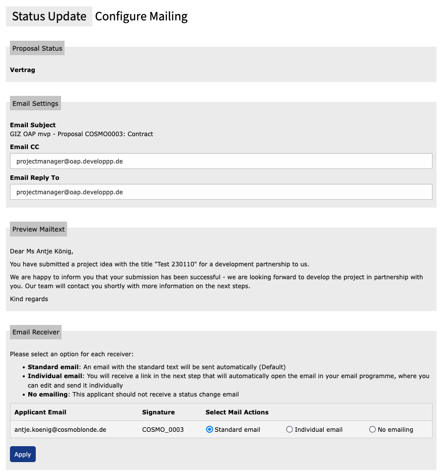

**Email settings**

The e-mail address of the currently logged-in editor is entered here; this can also be overwritten.

To optimise communication after an acceptance or rejection, the appropriate sender should be entered here.

**Preview Mailtext**

The mail text has been predefined  (Editor role/rights required)

**Email Receiver**

For each recipient of the selected applications listed here, you can select whether the standard mail text, no mail or an individual mail is to be sent.

If the individual mail is selected, a preview opens in the personal e-mail programme after "Apply" and can be edited and sent there.

### Export functions

#### Export of a single application as PDF

In the preview of an application (see chapter "preview of the proposals"), the function for downloading the application as a PDF document is at the top right.

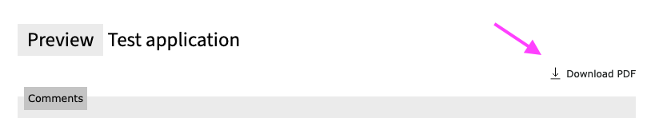

#### Export function in the overview

After selecting one or more submitted applications from the list, the export functions are displayed above.
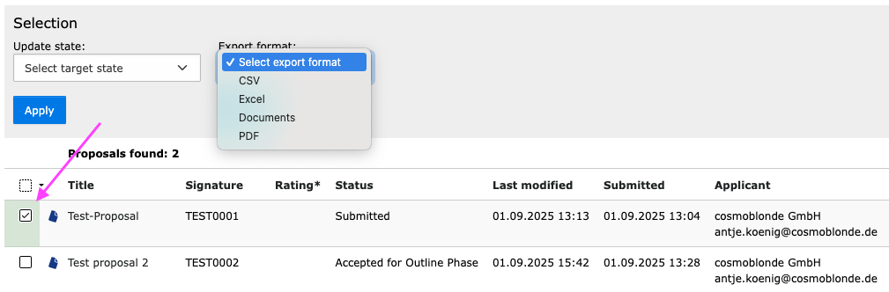

**Possible export formats**

- **CSV** - all application data as comma-separated values
- **Excel** - Application data as excel file
- **Documents** - Application data as PDF and Word file including documents uploaded by the applicant in a directory structure as zip file
- **PDF** - Application data as PDF file

### Special Function Assessment

***Only used optionally in OAP.***

If an assessment has been set up for a call, the corresponding assessment questions can be found in the detailed view of a submitted proposal.

This is an **example** — the individual number of questions and content will be determined by the editor:

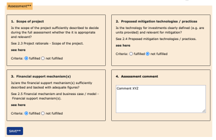

If a reference to a specific answer in the form has been set for an assessment item, "see here" is used to jump to the corresponding section of the proposal.

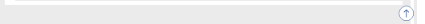

With the jump upwards you come back to the top of the page.

Once all questions have been answered and any comments added, the rating must be saved.

#### Filter

The overview list can then be filtered according to the ratings

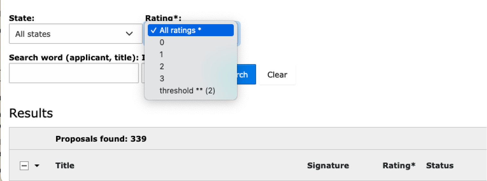

#### Export

In the csv export, columns are added at the beginning of the table for a call with assessment.
In this example:

- Assessment (intern) - Sum of the valuation

- Reviewer (intern) - Name of the user who (last) saved the rating

- Reviewed on (intern) - Timestamp of the (last) saving

- Assessment item title 1 – (1=fulfilled)

- Assessment item title 2 – (1=fulfilled)

- Assessment item title 3 – (1=fulfilled)

- Assessment comment

### Glossary

| Term                    | Description                                                                                                                                                                                                                                                       |
| ----------------------- | ----------------------------------------------------------------------------------------------------------------------------------------------------------------------------------------------------------------------------------------------------------------- |
| Applicant               | Registered frontend user - identified by username = e-mail address.                                                                                                                                                                                               |
| Backend                 | Calling through OAP URL and "/typo3. The backend is the user interface for the creation and processing of calls as well as the management of applications.                                                                                                        |
| Call                    | Short for "Call of Applications" is the data set that corresponds to a created form and contains the data that has the time period and other information of the call, such as the name of the application, which user groups can access the form in the frontend. |
| Clerk                   | Backend users with the assigned role "clerk" have access to the application management.                                                                                                                                                                           |
| Editor                  | Backend users with the assigned role "editor" have access to the possibility to edit calls and texts for website and mails.                                                                                                                                       |
| Frontend                | Website / user interface for the applicants.                                                                                                                                                                                                                      |
| Frontend user / FE-User | Registered users/applicants                                                                                                                                                                                                                                       |
| Proposal                | Synonym for the (completed/submitted) application form. The term "proposal" is used throughout in the backend, but can be individualised in the frontend depending on the call (concept, sketch, etc.).                                                           |
| TYPO3 backend           | See "Backend"                                                                                                                                                                                                                                                     |

## Backup Admin >> only with role "Admin"!

With this tool you can create a complete backup of your TYPO3 installation. The backup includes:

1. All files of the TYPO3 installation
2. The complete database

1. **"Start Backup"** - starts backup
